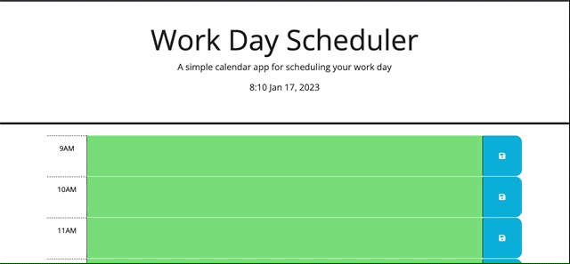

# work-day-scheduler
 Work Day Scheduler

# Description
This project uses jquery and day.js for a day scheduler.

# Completed Task
- Update backround colors for hour blocks based on past present and future.
- Display current time and date in the header.
- Save text input to hour blocks in local storage with save button.

# Links
[Code Repository](https://github.com/Justin-Brueske/work-day-scheduler)

[Deployed Site](https://justin-brueske.github.io/work-day-scheduler/)

# Usage 
Can be viewed in desktop or mobile web browser.

